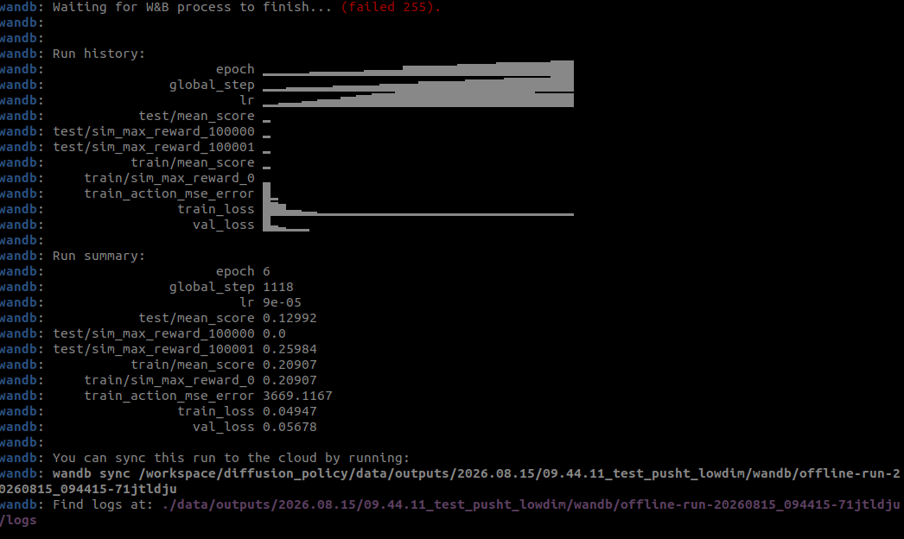
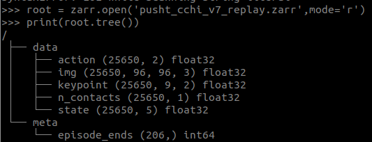

# Diffusion Policy on Docker (Local Laptop, MX250 2GB VRAM)
노트북(Ubuntu 22.04 호스트)에서 [real-stanford/diffusion_policy](https://github.com/real-stanford/diffusion_policy)
저장소가 요구하는 Ubuntu 20.04 + CUDA 11.3 환경을 Docker로 재현하고, 실제로 학습 파이프라인이
GPU에서 도는지 검증한 기록.

## 1. 하드웨어 / 목표
 
| 항목 | 값 |
|---|---|
| GPU | NVIDIA GeForce MX250 (VRAM 2GB, compute capability 6.1) |
| CPU | Intel Core i7 10th Gen |
| RAM | 16GB |
| 호스트 OS | Ubuntu 22.04 |
| 목표 | 20.04 전용 저장소를 22.04 호스트에서 Docker로 재현, PushT(state 기반) 태스크로 학습 파이프라인 검증 |

## 2. 디렉토리 구조
 
```
dp-docker/
├── Dockerfile
├── docker-compose.yml
├── entrypoint.sh
├── .dockerignore
├── README.md
└── diffusion_policy/      <- git clone 결과물 (호스트에 clone, 볼륨으로 마운트)
    └── data/
        └── pusht/
            └── pusht_cchi_v7_replay.zarr
```
diffusion_policy와 같은 폴더안에 도커파일들 있도록 설정

## 3. Dockerfile
 
```dockerfile
FROM nvidia/cuda:11.3.1-cudnn8-devel-ubuntu20.04
```
- 저장소 README가 명시한 **Ubuntu 20.04 + CUDA 11.3** 조합을 그대로 베이스 이미지로 사용.
- `devel` 태그를 쓴 이유: `mujoco_py`, `pybullet-svl` 등 일부 pip 패키지가 C/C++ 소스를 직접
  컴파일하기 때문에 컴파일러(gcc/g++)와 헤더가 필요함. (`runtime` 태그로는 불가)


apt 패키지:
```dockerfile
RUN apt-get update && apt-get install -y --no-install-recommends \
    git wget curl ca-certificates build-essential \
    libosmesa6-dev libgl1-mesa-glx libgl1-mesa-dev libglfw3 libglew-dev \
    patchelf ffmpeg \
    && rm -rf /var/lib/apt/lists/*
```
- `libosmesa6-dev`, `libgl1-mesa-glx`, `libglfw3`, `patchelf` : 저장소 README가 명시한 mujoco 렌더링 필수 패키지.
- `build-essential` : pip 소스 빌드용 컴파일러.
- `ffmpeg` : rollout 결과를 mp4로 저장할 때 필요.
mamba(Miniforge) 설치:
```dockerfile
RUN wget -q https://github.com/conda-forge/miniforge/releases/latest/download/Miniforge3-Linux-x86_64.sh -O /tmp/miniforge.sh \
    && bash /tmp/miniforge.sh -b -p $CONDA_DIR
```
- 저장소 README가 conda보다 mamba를 권장 (동일 기능, C++ solver라 훨씬 빠름).


## 4. docker-compose.yml
 
```yaml
volumes:
  - ./diffusion_policy:/workspace/diffusion_policy   # 코드+데이터, 호스트에서 clone한 것을 마운트
  - conda_envs:/opt/conda/envs                        # named volume, conda 환경 영속화
```
- `conda_envs`를 **named volume**으로 분리한 이유: `mamba env create`는 시간이 오래 걸리는 작업이라
  컨테이너(`--rm`으로 매번 삭제됨)와 분리해서, 컨테이너를 새로 띄워도 환경을 재사용할 수 있게 함.

GPU 연결:
```yaml
deploy:
  resources:
    reservations:
      devices:
        - driver: nvidia
          count: all
          capabilities: [gpu]
```
## 5. 최종 학습 실행 커맨드 및 환경변수 설명
 
```bash
export WANDB_MODE=offline   # (선택, logging.mode=offline과 중복 방지 목적이면 생략 가능)
 
python train.py \
  --config-dir=. \
  --config-name=train_diffusion_unet_lowdim_workspace.yaml \
  task=pusht_lowdim \
  training.seed=42 \
  training.device=cuda:0 \
  training.num_epochs=20 \
  dataloader.batch_size=64 \
  task.env_runner.n_test=2 \
  task.env_runner.n_test_vis=1 \
  task.env_runner.n_train=1 \
  task.env_runner.n_train_vis=1 \
  logging.mode=offline \
  hydra.run.dir='data/outputs/${now:%Y.%m.%d}/${now:%H.%M.%S}_test_pusht_lowdim'
```
 
| 옵션 | 기본값 | 변경값 | 이유 |
|---|---|---|---|
| `task` | - | `pusht_lowdim` | 이미지 기반 태스크는 CNN 인코더 때문에 VRAM 부담이 커서, state(keypoint) 기반의 저VRAM 태스크로 선택 |
| `training.num_epochs` | 수백~수천 | `20` | 성능 재현이 아니라 "GPU에서 학습 파이프라인이 정상 동작하는지" 검증이 목적이라 짧게 설정 |
| `dataloader.batch_size` | (config 기본값) | `64` | 2GB VRAM 한도 내 안전 마진 확보 (OOM 시 32→16으로 추가 축소 가능) |
| `task.env_runner.n_test` | 50 | `2` | 평가 시 병렬로 띄우는 시뮬레이션 환경 개수. 기본값이 RAM 16GB에서 OOM(워커 프로세스 대량 사망)을 유발해서 축소 |
| `task.env_runner.n_train` | 6 | `1` | 위와 동일한 이유로 축소 |
| `task.env_runner.n_test_vis` / `n_train_vis` | 4 / 2 | `1` / `1` | rollout 비디오 저장 개수 축소 (디스크/메모리 절약) |
| `logging.mode` | `online` | `offline` | wandb 계정 로그인/API 키 없이 로컬에만 로그 저장 |
| `training.device` | - | `cuda:0` | MX250 GPU 사용 지정 |
 

## 6. 디스크 관리 메모
 
- `nvidia/cuda:...-devel-ubuntu20.04` 베이스 이미지 자체가 CUDA devel/컴파일러 포함이라 용량이 큼 (이미지 총 14.9GB, 실 디스크 사용 4.95GB)
- `conda_envs` 볼륨(robodiff 환경 전체) 약 8.6GB — **절대 `docker volume prune`으로 지우면 안 됨**
- `docker builder prune -a -f`로 빌드 캐시는 주기적으로 정리 권장 (재빌드 시 다시 쌓임)
- PushT low-dim 데이터셋(`pusht.zip`)은 30MB로 가벼움 — 용량 부담 거의 없음
 

## 메모
```
mkdir dp-docker
cd ~/dp-docker

git clone https://github.com/real-stanford/diffusion_policy.git

docker compose build

docker compose run --rm diffusion_policy 
```
```
docker compose run --rm diffusion_policy 

mkdir로 data 폴더 만들어서 아래 파일 다운받았던것같음 위에 트리 확인해서 하기!

wget https://diffusion-policy.cs.columbia.edu/data/training/pusht.zip
#https://diffusion-policy.cs.columbia.edu/data/training/ 사이트
```
데이터 받아서 압축 풀면
data/pusht/pusht_cchi_v7_replay.zarr
경로로 데이터가 들어가짐!! pusht 안에 한던 더 싸여있는 구조임


컴퓨터 너무 뜨거워져서 6에폭째에 꺼버림


# 그냥 재밌어서 적어둔거

# 데이터 구조

## 전체 요약
 
- 총 스텝 수: 25,650 (모든 에피소드를 이어붙인 길이)
- 에피소드 수: 206개
- 평균 에피소드 길이: 약 124 스텝 (25650 / 206)
## 각 배열 의미
 
| 이름 | shape | 의미 |
|---|---|---|
| `action` | (25650, 2) | 각 스텝에서 취한 액션. pusht는 end-effector를 (x, y) 평면상에서 움직이는 태스크라 2차원 |
| `state` | (25650, 5) | lowdim 학습에 쓰이는 저차원 상태. 보통 `[agent_x, agent_y, block_x, block_y, block_angle]` 구성 |
| `keypoint` | (25650, 9, 2) | T블록 위의 9개 keypoint 좌표 (x, y). keypoint 기반 관찰을 쓰는 변형 실험에 사용 |
| `img` | (25650, 96, 96, 3) | 96x96 RGB 이미지. image 기반 학습용 (lowdim에서는 안 씀) |
| `n_contacts` | (25650, 1) | 접촉 개수 (물리 시뮬레이션 접촉 정보, 보통 학습에 직접 안 씀) |
| `episode_ends` | (206,) | 각 에피소드가 전체 시퀀스에서 몇 번째 인덱스까지인지 (누적 인덱스) |
 
## 참고
 
- `state`(lowdim용)와 `img`(image용) 데이터가 하나의 zarr 파일에 함께 저장되어 있음.
- `pusht_lowdim.yaml` 사용 시 `state`만 읽고, `pusht_image.yaml` 사용 시 `img`(+일부 저차원 값)를 읽음.
- obs_dim=20은 여러 timestep을 stack하여 만들어지는 값 (예: n_obs_steps=2 등).